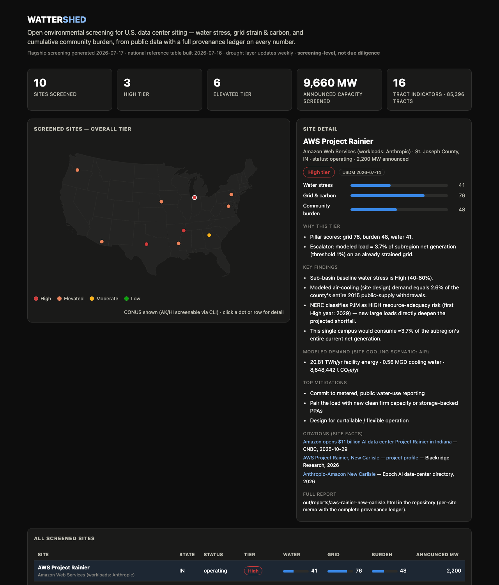
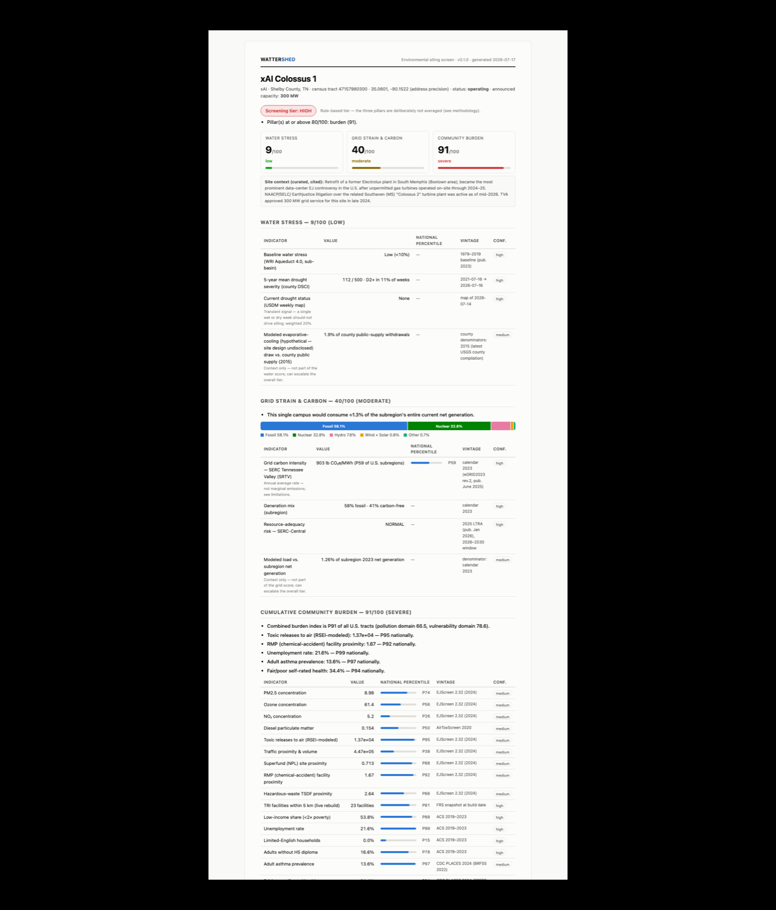
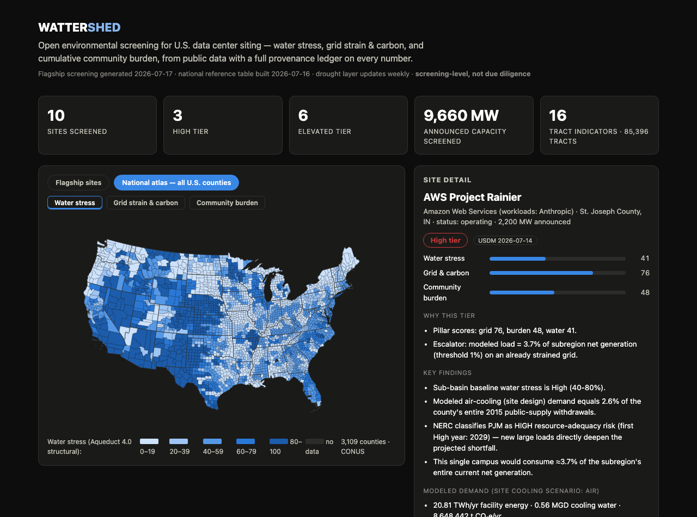

# Wattershed

**Open environmental screening for U.S. data center siting** — water stress,
grid strain & carbon, and cumulative community burden, from public data,
with a provenance ledger on every number.

Give it any U.S. location — coordinates, a street address, or one of ten
hand-curated real sites — and it returns a defensible, source-cited
screening: three pillar scores, an overall action tier with its trigger
rules shown, a modeled demand table (energy / water / CO₂e by cooling
design), named nearby facilities, mitigation options with real-world
precedents, and a client-grade HTML memo whose every value carries a source,
vintage, and retrieval date.



## Why this exists (and why now)

Data center construction is the most contested environmental-review category
in the U.S. right now: hundreds of state bills, moratoria in dozens of
jurisdictions, and siting fights from Memphis to Tucson. The two federal
screening tools that covered part of this ground — EPA's EJScreen and CEQ's
CEJST — were withdrawn from public access in 2025. Their underlying data is
still public. NERC's January 2026 reliability assessment names data centers
as the dominant driver of U.S. demand growth, with 13 of 23 assessment areas
at elevated or high resource-adequacy risk.

So the questions communities, journalists, planners, and consultants keep
asking — *is this a reasonable place for high-water cooling? what does this
load do to this grid? who already lives with the pollution here?* — currently
have no open tool that answers them together, with citations. Wattershed is
that tool.

## Quick start

```bash
git clone <this-repo> && cd wattershed
python -m venv .venv && source .venv/bin/activate
pip install -e .

# screen any U.S. point (no API keys — all sources are keyless)
wattershed screen --lat 32.0486 --lon -110.7739 --name "SE Tucson test" --mw 200 --cooling air

# screen a curated real site and write the full memo
wattershed screen --site xai-colossus-memphis --report memphis.html

# the whole flagship set + dashboard
wattershed screen-all --out-dir out
wattershed build-dashboard
open site/index.html

# portfolio mode: score a whole CSV of candidate sites
wattershed batch candidates.csv --out-dir out/batch   # name,lat,lon[,mw,cooling]
```

Works offline-from-clone for the national indicator layers: the tract
reference table (85,396 tracts × 16 indicators), the Aqueduct U.S. extract,
and the TRI facility table ship in `data/processed/` with a build manifest.
Live layers (this week's Drought Monitor, county drought history, nearby-
facility lookups, geocoding) fetch keylessly at screen time.
`wattershed build-reference` rebuilds every committed artifact from primary
sources so you can diff my build against yours.

## What a screening contains



- **Water stress (0–100):** WRI Aqueduct 4.0 baseline water stress (50%) +
  five-year county drought climatology from the U.S. Drought Monitor (30%) +
  this week's USDM category (20%).
- **Grid strain & carbon (0–100):** eGRID2023 subregion CO₂e-rate percentile
  (60%) + NERC 2025 LTRA resource-adequacy category (40%), with the
  subregion→NERC crosswalk confidence flagged.
- **Community burden (0–100):** a CalEnviroScreen-style pollution ×
  vulnerability index rebuilt from primary sources (ACS, CDC PLACES, EPA
  FRS/TRI, restored EJScreen 2.32 fields), ranked against every populated
  U.S. tract. Race is reported for transparency but not scored.
- **Overall tier (Low/Moderate/Elevated/High):** rule-based — the pillars
  are deliberately *not* averaged; modeled demand can escalate the tier
  (e.g. cooling draw ≥2% of county public supply). Every tier lists its
  trigger reasons.
- **Demand scenarios:** announced MW → TWh/yr, cooling water by design
  (evaporative/hybrid/air), % of county public supply, t CO₂e/yr, indirect
  generation-water estimate — all labeled as modeled, never as measured.
- **Mitigations with precedents:** reclaimed-water contracts (Loudoun
  Water), nuclear/clean-firm colocation (Susquehanna), curtailable-load
  frameworks (ERCOT SB6), community-benefits agreements — matched to
  whichever pillar drives the tier.
- **Provenance ledger:** every source consulted for *this* screening, with
  vintage and retrieval timestamp.

## The National Siting Pressure Atlas

The dashboard's second view is, to my knowledge, the first open national map
of data-center siting pressure: **every CONUS county (3,109) scored on all
three pillars**, computed entirely from the committed reference artifacts
and toggleable as water / grid / burden choropleths. No project is assumed,
so the atlas shows the pure location signal — where structural water
scarcity, grid strain, and community burden each concentrate, and (the
design's point) how differently they distribute. Rebuild it yourself:
`wattershed build-atlas` → `data/processed/county_atlas.csv`.



Atlas honesty notes: county water uses the Aqueduct structural layer only
(the 5-year drought climatology and weekly USDM join at site-screening
time); atlas scores carry no demand escalators and no action tiers — tiers
are project-screening outputs, not map paint.

## The flagship analysis

Ten real, named sites — operating, under construction, contested, and one
rejected — screened on live data ([full analysis](docs/FLAGSHIP_ANALYSIS.md),
[per-site memos](out/reports/)):

| Site | Water | Grid | Burden | Tier |
|---|---:|---:|---:|---|
| xAI Colossus 1 (Memphis, TN) | 9 | 40 | **91** | **High** |
| Stargate Site 1 (Abilene, TX) | 55 | 56 | 2 | **High** |
| AWS Project Rainier (New Carlisle, IN) | 41 | **76** | 48 | **High** |
| Project Blue (Tucson, AZ) | **70** | 22 | 23 | Elevated |
| Google The Dalles (OR) | 26 | 52 | **73** | Elevated |
| Google Council Bluffs (IA) | 15 | **78** | 42 | Elevated |
| Meta Hyperion (Richland Parish, LA) | 38 | 58 | 15 | Elevated |
| PW Digital Gateway (VA — killed 7/2026) | 55 | 47 | 3 | Elevated |
| AWS Susquehanna (Berwick, PA) | 6 | 49 | 1 | Elevated |
| Meta Newton County (GA) | 36 | 31 | 26 | Moderate |

The finding that matters: **no two of these fights are the same fight** — 
Memphis is a burden case with no water problem, Abilene a water-and-grid
case with no neighbors, Council Bluffs a clean-PPA site on a coal-heavy
physical grid. A single composite score would have erased exactly the
differences that decide which mitigation is relevant. That's why there isn't
one.

The set also includes an honest miss: Meta Newton County screens *Moderate*
even though neighbors' wells ran dry there — parcel-scale construction
hydrology is invisible to tract-level screening, and the analysis says so
and derives the v2 roadmap from it.

## Documentation

| Doc | Contents |
|---|---|
| [METHODOLOGY.md](docs/METHODOLOGY.md) | Every scoring decision, its rationale and alternatives; tier rules; computed sensitivity analysis |
| [DATA_SOURCES.md](docs/DATA_SOURCES.md) | All 16 sources with vintage, license, access mode; post-2025 resilience notes |
| [LIMITATIONS.md](docs/LIMITATIONS.md) | 15 numbered limitations, each also surfaced in tool output where it applies |
| [FLAGSHIP_ANALYSIS.md](docs/FLAGSHIP_ANALYSIS.md) | The ten-site comparative analysis |
| [SELF_ASSESSMENT.md](docs/SELF_ASSESSMENT.md) | What's strong, what's weaker than it looks, v2 roadmap |

## Engineering notes

- Python 3.11+; `geopandas`/`shapely` spatial core; `pydantic` result models
  (the JSON contract); `typer` CLI; Jinja2 memos; a dependency-free SVG
  dashboard (Albers USA projection computed in Python — no tiles, no CDN,
  works from `file://`).
- All 16 data sources are free **and keyless** — including national ACS
  rebuilds via the Census bulk summary files. Optional `.env` keys (EIA)
  only unlock enrichments.
- `pytest` unit suite (scoring rules, demand math, provenance registry,
  projection, registry schema) + CI via GitHub Actions; the network layer is
  exercised by the reproduction path (`wattershed build-reference`).
- The curated registry (`data/curated/sites.yaml`) is hand-compiled with
  per-fact citations and an explicit honesty contract in its header — no
  scraping, no claimed completeness.

## Honest limits, up front

Screening-level only — not an EIA, not due diligence. Tract statistics
describe areas, not parcels. eGRID rates are annual averages, not marginal
emissions. County water denominators are 2015 (latest USGS county census).
Five pollution indicators are frozen at EPA's withdrawn EJScreen 2.32.
Demand figures are engineering estimates from announced capacity. The full
list, with the reasoning, is [LIMITATIONS.md](docs/LIMITATIONS.md).

## Attribution

The U.S. Drought Monitor is jointly produced by the National Drought
Mitigation Center at the University of Nebraska-Lincoln, the USDA, and NOAA.
Water-risk data: Kuzma et al. (2023), Aqueduct 4.0, World Resources
Institute (CC BY 4.0). Grid data: EPA eGRID2023. Reliability categories:
NERC 2025 LTRA. Burden inputs: U.S. Census Bureau, CDC, EPA, and the Public
Environmental Data Partners' restored EJScreen 2.32.

MIT licensed. Built as an open portfolio project in environmental
engineering; issues and corrections welcome.
