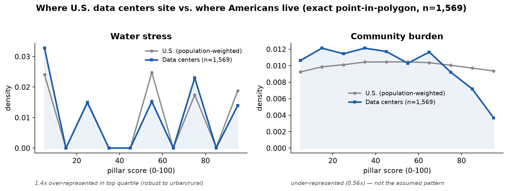

# Do U.S. data centers site disproportionately in water-stressed, grid-strained, or high-burden communities?

**An exploratory national analysis — with the controls that change the answer.**
This is the empirical study Wattershed was built to enable: instead of asking
whether the *tool* is nice, it asks a research question the field cares about,
and reports the answer honestly, including where a naive reading is wrong.

Reproduce: `python -m wattershed.pipelines.siting_equity`

## Data and method

- **Data-center census (n = 1,569):** OpenStreetMap facilities
  (`telecom`/`man_made=data_center`, CONUS) unioned with hand-verified flagship
  and validation campuses, deduplicated (`data/study/datacenters_census.csv`).
  OSM is openly licensed and **not selected for controversy**, which is what
  makes this a fair test rather than a restatement of hand-picked cases.
- **Exact geographies:** every site's census tract and county are assigned by
  **FCC point-in-polygon** (the same authoritative service the live tool uses);
  95.6% resolved exactly, the rest by nearest populated centroid.
- **Scores:** community burden at the site's exact tract (national percentile);
  water and grid at the exact county (their true resolution).
- **Baseline:** the **population-weighted** national distribution, so the
  question is "disproportionate relative to where Americans live."
- **Tests:** (1) distributional — Mann–Whitney U, KS, rank-biserial effect,
  top-quartile over-representation; (2) an **urban-stratified robustness check**
  to rule out OSM's urban coverage skew; (3) a **county-level logistic
  regression** controlling for population — the test that reveals what the raw
  comparison hides.

## Results

**Descriptive — data-center locations vs. the national population-weighted baseline:**

| Pillar | DC median | Nat. median | % of DCs in national top quartile | Over-representation | Effect | p |
|---|---|---|---|---|---|---|
| **Water stress** | 50.0 | 50.0 | **35.8%** | **1.43×** | +0.04 | 0.04 |
| **Community burden** | 41.7 | 49.9 | 14.0% | **0.56×** | −0.13 | <1e-6 |
| **Grid strain & carbon** | 49.3 | 49.3 | 19.2% | 0.77× | −0.28 | <1e-6 |

**Water over-siting is not an urban-coverage artifact** (over-representation in
the most water-stressed counties, within each stratum):

| Stratum | DC-host counties | Over-representation in top water quartile |
|---|---|---|
| Metro (pop ≥ median) | 260 | 1.29× |
| Non-metro (pop < median) | 20 | 1.80× |

**County-level logistic — P(county hosts ≥1 data center), standardized predictors:**

| Predictor | Odds ratio per SD | p |
|---|---|---|
| Water stress | 1.03 | 0.72 |
| Grid strain & carbon | 1.14 | 0.09 |
| Community burden | 0.94 | 0.51 |
| **Log population (control)** | **6.36** | **<0.001** |

(3,212 counties, 280 hosting; pseudo-R² = 0.33.)

## What it says — and why the logistic matters

**1. Descriptively, data centers over-concentrate in the most water-stressed
counties (1.43×), and it is real.** 36% land in the national top water-stress
quartile versus the 25% expected by chance, it is now statistically significant,
and — importantly — it holds in **both** metro (1.29×) and non-metro (1.80×)
counties, so it is not an artifact of OpenStreetMap mapping more urban (wetter,
eastern) facilities. If your question is "are data centers physically ending up
where water is scarce," the answer is yes, disproportionately.

**2. Community burden shows the opposite of the common assumption.** Data centers
are **under-represented** in the highest-burden communities (0.56×) — a finding
that *strengthened* when we switched from nearest-centroid to exact
point-in-polygon tracts. Individual sites like xAI Memphis are real and serious;
they are simply not the national pattern. This independently agrees with this
project's blind validation, which found siting conflict is socio-political, not
burden-driven.

**3. The control changes the story — and this is the real contribution.** Put all
three pressures plus population into one model, and **population overwhelmingly
drives siting (odds 6.4× per SD), while no environmental pressure independently
predicts it** (water p=0.72, burden p=0.51, grid p=0.09). In other words: data
centers follow people, power, and fiber. The water over-representation is a
genuine *consequence* of where population and infrastructure sit, not evidence
that developers independently seek — or avoid — water-stressed land.

That distinction is the whole point of doing the statistics instead of posting a
map. The honest headline is not "data centers target thirsty communities" and
not "data centers are fine" — it is: **data centers disproportionately end up in
water-stressed places, but because they chase population and infrastructure, not
because water scarcity itself attracts or repels them. The exposure is real; the
mechanism is population.** That has a direct policy implication: water-stress
mitigation has to be imposed at siting review, because the market that places
these facilities is not pricing water scarcity in at all.

## Limitations (still exploratory)

1. **Census coverage.** Primarily OSM, which under-maps some facilities; a fully
   de-biased national census does not exist openly and would be its own
   contribution. The urban-stratified check mitigates but does not eliminate this.
2. **Binary outcome.** The logistic models "hosts ≥1 data center." A count model
   (Poisson/negative-binomial on number of facilities) is the natural refinement
   and could reveal marginal effects the binary model misses.
3. **No economic covariates.** Land price, power price, fiber, and tax incentives
   — the actual siting levers — are not yet in the model; population is a proxy.
4. **Association, not causation**, and announced vs. operating facilities are not
   separated.

## Why this is the contribution (not the website)

The dashboard lets you *look at* the data. This *answers a question* about the
world, with a reproducible pipeline over open data, effect sizes, a robustness
check, a control that overturns the naive reading, and its own limitations
written down. The next steps — a de-biased census, a count model, economic
covariates — are a genuine research program, and they are stated here as such.
